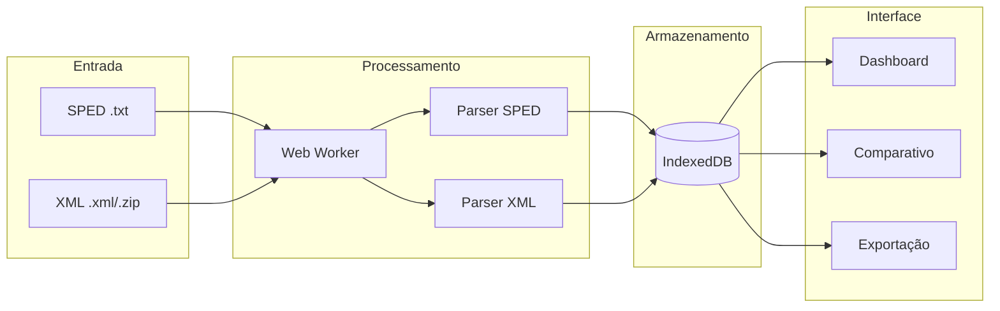

<div align="center">

# Analizador SPED Fiscal


**[Acessar aplicação](https://jobasfernandes.github.io/analise-sped-fiscal-efd-icms-ipi/)**

Aplicação web para análise de arquivos **SPED Fiscal (EFD ICMS/IPI)** e comparativo com XMLs de NFe/NFCe.  
Processamento 100% local no navegador com persistência offline via IndexedDB.

</div>

---

## Funcionalidades

| SPED Fiscal | XML NFe/NFCe | Visualização |
|-------------|--------------|--------------|
| Parser de registros 0000, C100, C190, C170 | Importação de arquivos .xml, .zip ou pastas | Gráficos interativos (Chart.js) |
| Indicadores por dia, CFOP e dia+CFOP | Filtro por período, CNPJ e CFOPs | Drill-down por CFOP |
| Persistência offline (IndexedDB/Dexie) | Rastreamento detalhado de notas ignoradas | Exportação CSV e PNG |
| Processamento assíncrono via Web Worker | Toggle para restringir a CFOPs do SPED | Tema claro/escuro |

---

## Arquitetura



---

## Importação de XML

**Formatos aceitos:** arquivos `.xml`, `.zip` ou drag-drop de pastas.

**Filtros aplicados:**
- Período do SPED (data de emissão `dhEmi`)
- CNPJ do emitente ou destinatário igual ao CNPJ base do SPED
- CFOPs permitidos (configurável) e CFOPs a excluir (padrão: 5929, 6929)
- Apenas notas autorizadas (`cStat = 100`)

**Rastreamento de notas ignoradas:** cada nota rejeitada é categorizada por motivo (cancelada, duplicada, fora do período, CNPJ diferente, sem itens válidos, XML inválido) com dados da nota e CFOPs originais disponíveis para consulta.

---

## Comparativo SPED vs XML

Agregação por **Dia + CFOP** comparando valores do SPED (registro C190) com a soma dos XMLs importados (`vProd`).

| Métrica | Fórmula |
|---------|---------|
| Diferença Absoluta | `Σ(vProd XML) − Σ(valorOperacao SPED)` |
| Diferença Percentual | `(XML − SPED) / SPED × 100` |

Divergências são destacadas visualmente. O botão "Zerar XMLs" remove dados do IndexedDB para reimportação.

---

## Execução local

```bash
git clone https://github.com/JobasFernandes/analise-sped-fiscal-efd-icms-ipi.git
cd analise-sped-fiscal-efd-icms-ipi
npm install
npm run dev     # http://localhost:3001
npm test        # Testes com Vitest
```

---

## Estrutura do projeto

```
src/
  components/     Dashboard, Upload, Comparativo, CfopDetalhes
  db/             Schema IndexedDB e DAOs (spedDao, xmlDao)
  utils/          Parsers (SPED, XML), processamento, serviços
  workers/        Web Workers para parsing assíncrono
tests/            Suite de testes automatizados
```

---

## Limitações

- Foco analítico no Bloco C (documentos fiscais). Não valida assinatura digital.
- Valores de impostos são exibidos conforme o arquivo; não há recálculo tributário.

---
### Se este projeto ajudou você, deixe uma ⭐ e contribua com ideias!
---

## Licença

MIT - Consulte [LICENSE](LICENSE.txt) para detalhes.
