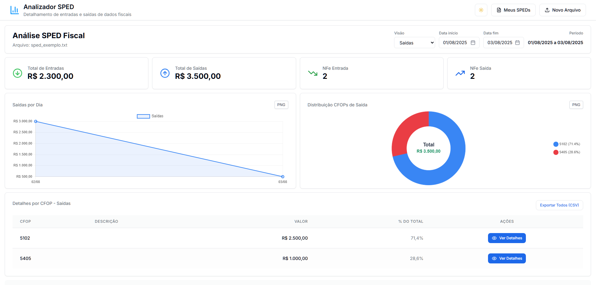
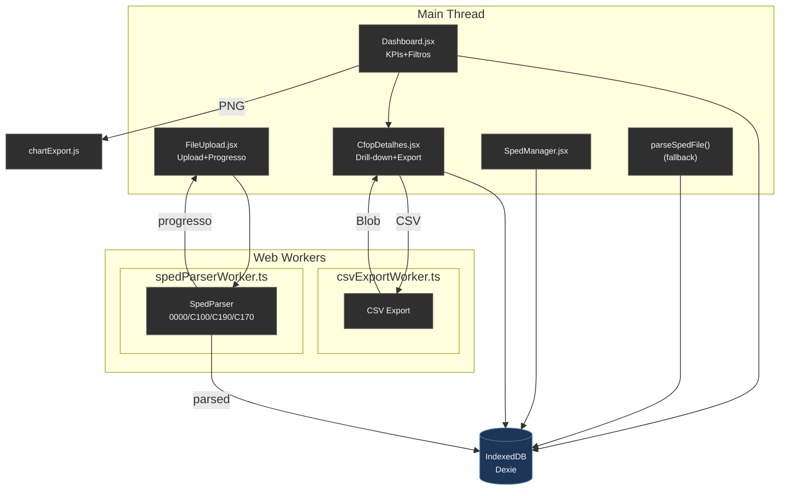

<div align="center">

# Analizador SPED Fiscal



<p><strong>Deploy (GitHub Pages):</strong> <a href="https://jobasfernandes.github.io/analise-sped-fiscal-efd-icms-ipi/" target="_blank">Acesse aplicação</a></p>

Aplicação web (client-side) para análise exploratória e visualização de dados de arquivos **SPED Fiscal** (Bloco C) inteiramente no navegador: parsing local, agregações, indicadores, gráficos, exportações e persistência offline com **IndexedDB/Dexie**.

</div>

## ✨ Principais funcionalidades

- Upload seguro (drag & drop) — o arquivo não sai do seu navegador
- Parser robusto com suporte aos registros: **0000, C100, C190 e C170**
- Filtragem automática: somente notas em situação normal (`COD_SIT = 00`) e valores positivos
- Cálculo de indicadores ("Indicadores") pré‑computados: soma por dia, por CFOP e por dia+CFOP
- Visualizações interativas (Chart.js + react-chartjs-2):
  - Entradas por dia
  - Saídas por dia
  - Comparativo Entradas vs Saídas
  - Distribuição de CFOPs (entrada/saída)
- Drill‑down de CFOP com modal de detalhes (itens e notas relacionadas)
- Índice rápido (`itensPorCfopIndex`) para abertura instantânea dos detalhes
- Exportação **CSV** (por CFOP ou consolidado Entradas/Saídas) — com Web Worker para grandes volumes
- Exportação de gráficos em **PNG** (utilitário em `chartExport.js`)
- Filtro de período com preenchimento automático (registro 0000) + persistência via query string
- Modalidade de visualização: Entradas | Saídas | Comparativo
- Tema claro/escuro com toggle e persistência local
- **Tooltips Radix UI** padronizados (acessibilidade e consistência)
- Persistência offline completa (IndexedDB) + carregamento rápido via indicadores
- Reprocessamento de indicadores sob demanda (por SPED ou todos)
- Backup/restore do banco local (exporta/importa JSON)
- Parsing assíncrono com Web Worker (interface permanece responsiva) + fallback síncrono
- Testes automatizados (Vitest) incluindo regressão de fuso/UTC e parsing de C170

## 🧬 Arquitetura (alto nível)



## 🗂 Persistência & Indicadores

Tabelas (Dexie):

- `sped_files` (metadados do arquivo / hash / período)
- `documents` (notas C100)
- `items` (itens agregados C190)
- `items_c170` (itens detalhados C170)
- `day_aggs` (somas por dia)
- `cfop_aggs` (somas por CFOP)
- `day_cfop_aggs` (somas por dia+CFOP)

Carregamento rápido utiliza `getSpedProcessed` que reconstrói um `ProcessedData` diretamente a partir dos agregados. Se ausentes (SPED antigo), faz fallback processando linhas originais (`documents` + `items` / `items_c170`).

Funções de manutenção:

- `recalcularIndicadores(spedId)`
- `recalcularIndicadoresTodos()`
- `possuiIndicadores(spedId)`

Aliases de compatibilidade ainda expostos (ex: `rebuildAggregates`).

## 🧪 Testes

Executados com **Vitest** + **fake-indexeddb**.

Cobrem:

- Parsing de datas (regressão contra deslocamento de timezone)
- Reconstrução de indicadores vs adapter direto
- Parsing de C170 (itens detalhados)
- Progresso de parsing (worker / fallback)
- Funções de filtragem e agregação (`dataProcessor`)

Rodar:

```bash
npm test
```

## 🚀 Quick Start

```bash
git clone <repo>
cd sped
npm install
npm run dev
```

Acesse: http://localhost:3001 (ou porta informada pelo Vite).

## 🧾 Estrutura (resumida)

```
src/
   App.jsx                # Shell / Navbar / orquestra fluxo
   components/
      FileUpload.jsx       # Upload + progresso
      Dashboard.jsx        # KPIs, gráficos, filtros
      CfopDetalhes.jsx     # Modal drill‑down CFOP (C170/C190)
      SpedManager.jsx      # Gerenciador de SPEDs salvos
      ui/                  # Button, Card, Tooltip (Radix), Dialog, etc.
   db/
      daos/                # spedDao, spedProcessedDao
      adapters/            # toProcessedData
      index.ts             # Config Dexie
   utils/
      spedParser.ts        # SpedParser (0000/C100/C190/C170)
      dataProcessor.ts     # Formatação + agregações derivadas
      cfopService.ts       # Descrições CFOP
      chartExport.js       # Export PNG
   workers/
      spedParserWorker.ts  # Parsing assíncrono
      csvExportWorker.ts   # Exportação CSV em streaming
tests/                   # Suite Vitest
examples/
   sped_exemplo.txt       # Arquivo SPED fictício para demonstração
```

## 🧪 Arquivo de exemplo

Incluímos um arquivo fictício em `examples/sped_exemplo.txt` que cobre:

- Registro 0000 (período)
- 2 notas de entrada (C100) e 2 de saída (C100) em dias distintos
- Linhas C190 com CFOPs típicos (1102, 5102, 5405, 1202)
- Linhas C170 (itens detalhados) com valores e CFOP coerentes

Use-o para um primeiro teste: abra a aplicação, clique em “Meus SPEDs” para gerenciar ou faça o upload diretamente.

## 🧠 Decisões de design

| Tema           | Decisão                                                                |
| -------------- | ---------------------------------------------------------------------- |
| Parsing        | Linha a linha com streaming lógico em worker para escalabilidade       |
| Datas          | Parse local (date-fns) evitando `new Date('yyyy-MM-dd')` e offsets UTC |
| Performance    | Pré-cálculo de indicadores em tabelas auxiliares + fallback compatível |
| Acessibilidade | Tooltips Radix e foco preservado nos modais (Dialog)                   |
| Persistência   | Dexie com versionamento transparente e backup JSON                     |
| Exportações    | Web Worker para CSV grande + Canvas toDataURL para PNG                 |

## 🛡 Limites atuais

- Não valida assinatura fiscal ou integridade (objetivo analítico, não fiscalizador)
- Apenas bloco C considerado (foco em movimentações NFe)
- Não há autenticação (execução local)
- Cálculos de impostos exibidos conforme aparecem (não recalcula regras fiscais complexas)

## 🤝 Contribuição

Estilo de commits observado: `feat: ...`, `chore: ...`, `feat(db): ...`. Sugestão:

1. Abra uma issue descrevendo o objetivo
2. Branch: `feat/<slug>` ou `fix/<slug>`
3. Commits pequenos e claros
4. Rodar `npm run lint` e `npm run format` para padronizar o código
5. Rodar `npm test` antes do PR

---

Se este projeto ajudou você, considere deixar uma estrela ⭐ ou enviar sugestões!
