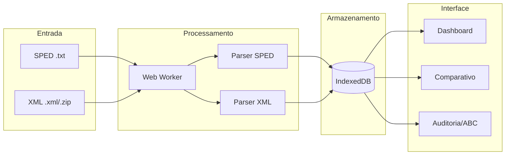

<div align="center">

# Analizador SPED Fiscal


**[Acessar aplicação](https://jobasfernandes.github.io/analise-sped-fiscal-efd-icms-ipi/)**

Aplicação web para análise de arquivos **SPED Fiscal (EFD ICMS/IPI)** e comparativo com XMLs de NFe/NFCe.  
Processamento 100% local no navegador com persistência offline via IndexedDB.

</div>

---

## Funcionalidades

| SPED Fiscal                                | XML NFe/NFCe                                | Visualização e Análise          |
| ------------------------------------------ | ------------------------------------------- | ------------------------------- |
| Parser de registros 0000, C100, C190, C170 | Importação de arquivos .xml, .zip ou pastas | Gráficos interativos (Chart.js) |
| Indicadores por dia, CFOP e dia+CFOP       | Filtro por período, CNPJ e CFOPs            | Drill-down por CFOP             |
| Persistência offline (IndexedDB/Dexie)     | Rastreamento detalhado de notas ignoradas   | **Curva ABC** (Produtos/Clientes)|
| Processamento assíncrono via Web Worker    | Toggle para restringir a CFOPs do SPED      | **Auditoria** de Gaps de Numeração|
| **Exportação/Backup** (JSON e TXT)         | Validação de Status (`cStat`)               | Exportação CSV e PNG            |

---

## Arquitetura



---

## Recursos Detalhados

### 1. Gestão de Dados e Backup
- **Persistência Local:** Todos os dados são salvos no navegador usando IndexedDB.
- **Backup Completo:** Exporte todo o banco de dados para um arquivo JSON e restaure em outra máquina ou navegador.
- **Manipulação de SPED:** Exporte o arquivo SPED original ou gere uma versão otimizada removendo registros analíticos (C170) para reduzir tamanho.

### 2. Importação de XML
**Formatos aceitos:** arquivos `.xml`, `.zip` ou drag-drop de pastas.

**Filtros automáticos:**
- Período do SPED (data de emissão `dhEmi`)
- CNPJ do emitente ou destinatário igual ao CNPJ base do SPED
- CFOPs permitidos (configurável) e CFOPs a excluir (padrão: 5929, 6929)
- Apenas notas autorizadas (`cStat = 100`)

**Rastreamento de rejeições:** Notas ignoradas são categorizadas por motivo (cancelada, duplicada, fora do período, CNPJ diferente, sem itens válidos) para auditoria.

### 3. Comparativo SPED vs XML
Agregação por **Dia + CFOP** comparando valores do SPED (registro C190) com a soma dos XMLs importados (`vProd`).

| Métrica              | Fórmula                                |
| -------------------- | -------------------------------------- |
| Diferença Absoluta   | `Σ(vProd XML) − Σ(valorOperacao SPED)` |
| Diferença Percentual | `(XML − SPED) / SPED × 100`            |

### 4. Auditoria e Análise Avançada
- **Curva ABC:** Identifique os produtos ou parceiros mais representativos.
- **Gaps de Numeração:** Detecte falhas na sequência numérica das notas fiscais (ex: nota 100, 102... falta a 101).
- **Registros Órfãos:** Identifique inconsistências entre cabeçalhos e itens.

---

## Privacidade e Segurança

🔒 **Privacidade em Primeiro Lugar:** Esta aplicação roda inteiramente no seu navegador ("Client-Side").
- Nenhum arquivo (SPED ou XML) é enviado para servidores externos.
- Seus dados fiscais nunca saem do seu computador.
- O funcionamento offline é garantido após o primeiro carregamento.

---

## Tecnologias Utilizadas

- **Core:** React, Vite, TypeScript
- **UI:** Tailwind CSS, Radix UI, Lucide Icons
- **Dados:** Dexie.js (IndexedDB Wrapper)
- **Visualização:** Chart.js, React-Chartjs-2
- **Testes:** Vitest, Testing Library

---

## Execução local

```bash
git clone https://github.com/JobasFernandes/analise-sped-fiscal-efd-icms-ipi.git
cd analise-sped-fiscal-efd-icms-ipi
npm install
npm run dev     # http://localhost:3001
npm test        # Testes com Vitest
```

---

## Estrutura do projeto

```
src/
  components/
    analytics/    # Curva ABC e relatórios avançados
    audit/        # Auditoria de gaps e orfãos
    dashboard/    # Componentes visuais principais
  db/             # Schema IndexedDB e DAOs
  utils/          # Parsers (SPED, XML) e lógica de negócio
  workers/        # Web Workers para processamento pesado
tests/            # Suite de testes automatizados
```

---

## Limitações

- Foco analítico no Bloco C (documentos fiscais). Não valida assinatura digital.
- Valores de impostos são exibidos conforme o arquivo; não há recálculo tributário complexo.

---

### Se este projeto ajudou você, deixe uma ⭐ e contribua com ideias!

---

## Licença

MIT - Consulte [LICENSE](LICENSE.txt) para detalhes.
